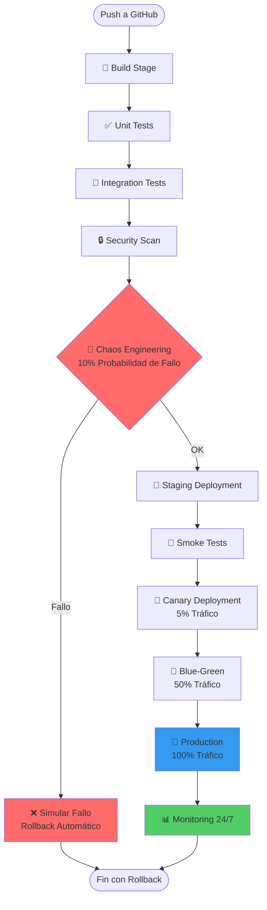

# 🚀 Pipeline CI/CD Avanzado - Inspirado en Netflix/Amazon

Pipeline CI/CD profesional con **Chaos Engineering** (fallo aleatorio) para aprender resiliencia, inspirado en las prácticas de Netflix y Amazon.

## 📊 Diagrama del Pipeline



## 🎯 Etapas del Pipeline

### 1. 🔨 **Build Stage**
Compila y empaqueta el código fuente.

### 2. ✅ **Unit Tests**
Ejecuta tests unitarios rápidos (cobertura mínima 80%).

### 3. 🔗 **Integration Tests**
Tests de integración entre servicios.

### 4. 🔒 **Security Scan**
Escanea vulnerabilidades de seguridad (OWASP, Snyk).

### 5. 🎲 **Chaos Engineering** (Fallo Aleatorio)
- **10% probabilidad** de simular un fallo
- **Propósito**: Enseñar resiliencia y recuperación automática
- **Inspiración**: Netflix Chaos Monkey
- Si falla → Rollback automático

### 6. 🧪 **Staging Deployment**
Despliega en entorno de staging idéntico a producción.

### 7. 💨 **Smoke Tests**
Tests rápidos para verificar que el sistema responde.

### 8. 🐤 **Canary Deployment**
Despliega a **5% del tráfico** real con monitoreo de 5 minutos.

### 9. 🔄 **Blue-Green Deployment**
Despliega a **50% del tráfico** (blue), luego 100% (green).

### 10. 🚀 **Production Deployment**
Despliegue completo a producción con monitoreo 24/7.

### 11. 📊 **Monitoring Continuo**
Monitoreo, métricas y alertas automáticas.

## 🎓 Aprendizaje de Resiliencia

El **fallo aleatorio** (Chaos Engineering) te enseña:
- ✅ Cómo detectar problemas temprano
- ✅ Cómo hacer rollback automático
- ✅ Cómo monitorear sistemas en tiempo real
- ✅ Cómo diseñar sistemas resilientes
- ✅ Cómo responder a incidentes

## 👀 Cómo Ver el Pipeline en GitHub

1. **Ve a tu repositorio**: https://github.com/Aquabag2/pipelines-
2. **Haz clic en la pestaña "Actions"** (arriba del repositorio)
3. **Verás el pipeline ejecutándose** con todas las etapas
4. **Haz clic en una ejecución** para ver los detalles de cada etapa

### 📸 Vista del Pipeline en GitHub Actions

```
Actions
└── 🎯 Netflix-Amazon Style Pipeline (#1)
    ├── 🔨 build ✅
    ├── ✅ unit-tests ✅
    ├── 🔗 integration-tests ✅
    ├── 🔒 security-scan ✅
    ├── 🎲 chaos-engineering ✅ (o ❌ si simula fallo)
    ├── 🧪 staging-deploy ✅
    ├── 💨 smoke-tests ✅
    ├── 🐤 canary-deploy ✅
    ├── 🔄 blue-green-deploy ✅
    ├── 🚀 production-deploy ✅
    └── 📊 monitoring ✅
```

## 🚀 Características Avanzadas

- ✅ **Resiliencia**: Rollback automático en cualquier etapa
- ✅ **Seguridad**: Escaneo automático de vulnerabilidades
- ✅ **Despliegue Gradual**: Canary → Blue-Green → Production
- ✅ **Monitoreo**: Observabilidad 24/7
- ✅ **Chaos Engineering**: Fallos aleatorios para aprender

## 📖 Inspiración

Este pipeline está inspirado en las mejores prácticas de:
- **Netflix**: Chaos Monkey, Spinnaker, despliegues canary
- **Amazon**: CodePipeline, blue-green deployments, monitoreo continuo

---

**Nota**: El pipeline se ejecuta automáticamente en cada push a `main` o `master`.

